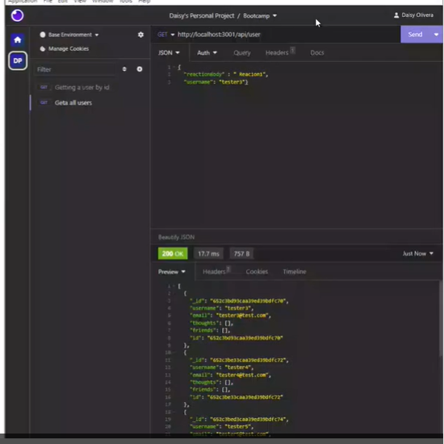

# Social Media API

 

## Description
This app uses MongoDB /Mongoose as the database that keeps the users, thoughts and reactions of a social media app.

## Table of Contents
* [Description](#description)
* [Installation](#installation)
* [Usage](#usage)
* [Contribution](#contribution)
* [Test](#test)
* [Links](#links)
* [Questions](#questions)
* [Screenshot](#screenshot)
* [License](#license)

## Installation
To use, run "npm run start " be sure to have installed dependencies

## Usage
NA

## Contribution
NA

## Test
NA

## Questions
You can reach me with questions at Djanetod@hotmail.com.
GitHub: OliveraDiaz

## Links
https://github.com/OliveraDiaz/SocialMediaAPI.git https://watch.screencastify.com/v/FGIdDdUXythflcC2O7BB

## Screenshot

